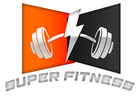

<p align="center">
  
</p>

<h1 align="center">⚡ Super Fitness: The Price of Excellence is Discipline</h1>

<p align="center">
  <em>A high-performance engineering marvel built for those who treat their health like code—optimized, refactored, and bug-free.</em>
</p>

<p align="center">
  
  
  
  
  
</p>

<p align="center">
  <a href="INSERT_LINK_TO_APK">
    
  </a>
</p>

<hr>

## 📸 App Showcase

### 🚀 First Impression & Secure Access
<p align="center">
  <table>
    <tr>
      <td align="center"><strong>Onboarding</strong></td>
      <td align="center"><strong>Login</strong></td>
      <td align="center"><strong>Social Auth</strong></td>
    </tr>
    <tr>
      <td></td>
      <td></td>
      <td></td>
    </tr>
  </table>
</p>

### 📊 Data-Driven Personalization (Registration Flow)
<p align="center">
  <table>
    <tr>
      <td align="center"><strong>Metric Pickers</strong></td>
      <td align="center"><strong>Goal Selection</strong></td>
      <td align="center"><strong>Activity Level</strong></td>
    </tr>
    <tr>
      <td></td>
      <td></td>
      <td></td>
    </tr>
  </table>
</p>

### 🏠 Home & Training Engine
<p align="center">
  <table>
    <tr>
      <td align="center"><strong>Home (Overview)</strong></td>
      <td align="center"><strong>Home (Details)</strong></td>
      <td align="center"><strong>Workouts</strong></td>
      <td align="center"><strong>Exercises</strong></td>
    </tr>
    <tr>
      <td></td>
      <td></td>
      <td></td>
      <td></td>
    </tr>
  </table>
</p>

### 🥗 Nutrition & Meal Intelligence
<p align="center">
  <table>
    <tr>
      <td align="center"><strong>Food Categories</strong></td>
      <td align="center"><strong>Meal Details (1)</strong></td>
      <td align="center"><strong>Meal Details (2)</strong></td>
    </tr>
    <tr>
      <td></td>
      <td></td>
      <td></td>
    </tr>
  </table>
</p>

### 🤖 Agentic AI Smart Coach
<p align="center">
  <table>
    <tr>
      <td align="center"><strong>AI Assistant</strong></td>
      <td align="center"><strong>Real-time Chat</strong></td>
      <td align="center"><strong>Chat History</strong></td>
    </tr>
    <tr>
      <td></td>
      <td></td>
      <td></td>
    </tr>
  </table>
</p>

### 👤 User Profile & Security
<p align="center">
  <table>
    <tr>
      <td align="center"><strong>Profile Overview</strong></td>
      <td align="center"><strong>Edit Profile</strong></td>
      <td align="center"><strong>Security Settings</strong></td>
    </tr>
    <tr>
      <td></td>
      <td></td>
      <td></td>
    </tr>
  </table>
</p>

---

## 🌟 Overview & Core Features

**Super Fitness** is designed to provide a frictionless and personalized health journey. From data-driven onboarding to a local-AI hybrid coach, every pixel is engineered for performance.

* 🔐 **Frictionless Authentication (Auth):**
  * Complete onboarding including **Social SSO** (Login via Google/Facebook).
  * Secure password recovery and token-based session management.

* 🏋️ **Dynamic Workout Engine:**
  * Exercises categorized by **Prime Mover Muscles** with caloric breakdown and duration metrics.
  * Smooth transitions between workout steps with detailed difficulty calibration.

* 🥗 **Nutrition Intelligence:**
  * Comprehensive caloric breakdown with ingredients lists and caloric density rendering for every meal.

* 🤖 **Smart Coach (Agentic AI Core):**
  * *The crown jewel of the app.* A personalized AI Agent aware of your Age, Height, Weight, and Goals.
  * Driven by a **Hybrid AI Engine** (Gemini Pro & Ollama) for intelligent, context-aware coaching.

---

## 🧠 Key Engineering Highlights

### 1. The "Big Use Case" Pattern
We eliminated the **"Fat Presentation"** anti-pattern by introducing the `GetHomeDataUseCase`. This orchestrator aggregates 6 disparate domain use cases into a single reactive stream.
* **Incremental Loading:** Data sections yield to the UI as they arrive, preventing "Wait-for-All" bottlenecks.
* **Factory UI Injection:** Uses a **Factory Pattern** to map domain sections into widgets, ensuring a decoupled home screen.

### 2. Agentic AI & RAG Logic
The Smart Coach acts as a **Personalized Agent**:
* **Contextual Injection:** Real-time user metadata is retrieved from the backend and injected into the AI prompt to ensure safety and precision.
* **State Preservation:** Full chat history is managed through Firestore, allowing a continuous "Memory" of the user's journey.

### 3. Precision UX & Asset Optimization (60 FPS)
* **Metric Engineering:** Custom-built **Wheel Pickers** for Height/Weight ensuring high data accuracy with haptic feedback.
* **Glassmorphic UI Engine:** Achieving a premium look using `BackdropFilter` layers without compromising performance.
* **Asset Caching:** Extensive use of `CachedNetworkImage` and `Lottie` to minimize network overhead and layout shifts.

### 4. Enterprise-Grade Clean Architecture
* **Strict Layering:** Isolation between Domain, Data, and Presentation layers for maximum testability.
* **Automated DI:** Managed via `get_it` and `injectable` for a clean, mockable dependency graph.
* **Type-Safe Networking:** Handled via `Retrofit` and `Dio` with robust error interceptors.

---

## ⚙️ Tech Stack & Dependencies

* **Core:** Flutter, Dart.
* **State Management:** BLoC / Cubit.
* **AI:** Gemini API & Ollama (Local LLM Integration).
* **Backend:** Firebase (Auth, Firestore, Storage).
* **Local Storage:** Hive for high-speed local persistence.
* **UI Utilities:** Google Fonts, Lottie, Flutter ScreenUtil.

---

## 🚀 Getting Started

1. **Clone the repository:**
   ```bash
   git clone [https://github.com/Flutter-Elevate-Team2/Fitness.git](https://github.com/Flutter-Elevate-Team2/Fitness.git)
   cd Fitness
   
   
## 🤝 The Team
**This project was built collaboratively by a dedicated team of engineers.**

**Mohamed Ibrahim** [](https://www.linkedin.com/in/mohamed-ibrahim39/) | [](https://github.com/MoHa270xX)

**Ahmed Hussien** [](https://www.linkedin.com/in/ahmed-hussien-02b499186/) | [](https://github.com/AhmedHussien249)

**Malak Hussien** [](https://www.linkedin.com/in/malak-hussein-b69418249/) | [](https://github.com/MALAK0244)

**Nagham Arafa** [](https://www.linkedin.com/in/nagham-arafa-5558942bb/) | [](https://github.com/NaghamArafa)
